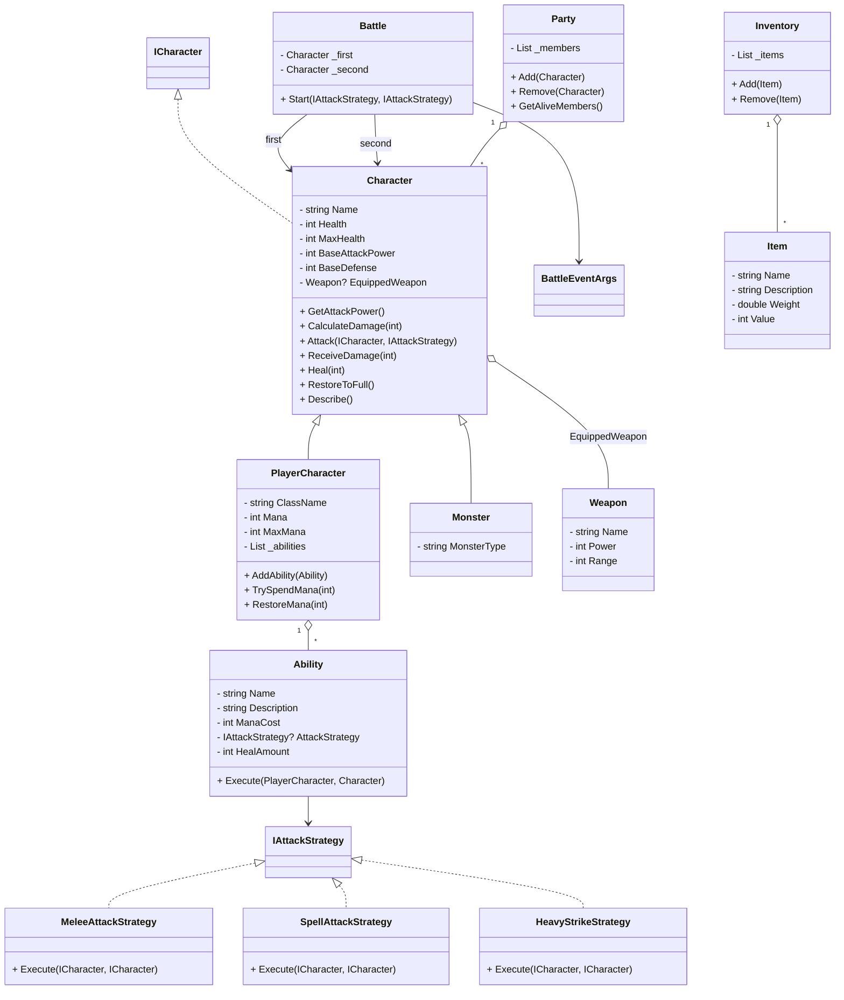

# UML-діаграма класів

Це просте і зрозуміле представлення основної архітектури проєкту `Practice-OOP_RPG`.

## Основні елементи

- `Character` — абстрактний базовий клас для персонажів.
- `PlayerCharacter` і `Monster` — конкретні типи персонажів.
- `Weapon` — озброєння, яке може бути оснащене персонажем.
- `Ability` — здібність гравця, яка може використовувати стратегію атаки або лікування.
- `Battle` — логіка бою між двома персонажами.
- `IAttackStrategy` — інтерфейс для патерну "Стратегія" атак.
- `Party` та `Inventory` — колекції для персонажів та предметів.

## Mermaid UML

