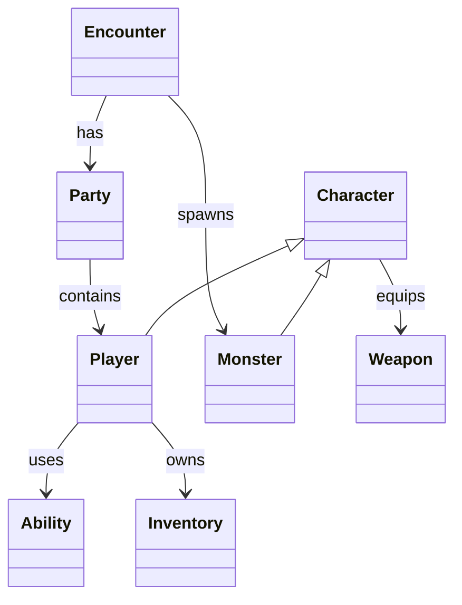

```mermaid
classDiagram
    %% Compact UML for GitHub
    class Character
    class Player
    class Monster
    class Ability
    class Weapon
    class Inventory
    class Party
    class Encounter

    Character <|-- Player
    Character <|-- Monster
    Player --> Ability : uses
    Player --> Inventory : owns
    Character --> Weapon : equips
    Party --> Player : contains
    Encounter --> Party : has
    Encounter --> Monster : spawns

    %% Focused and short so mermaid.live and renderers display reliably
```
